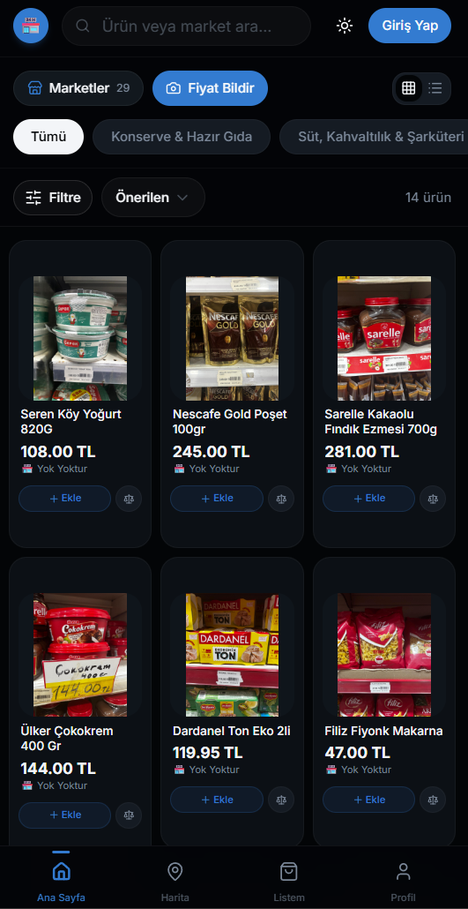
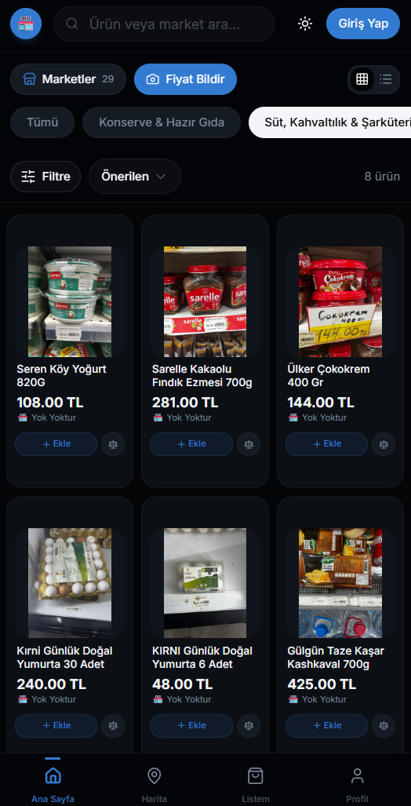
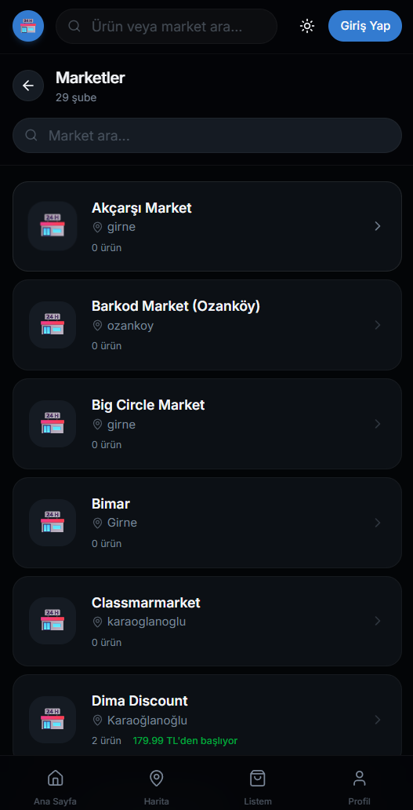
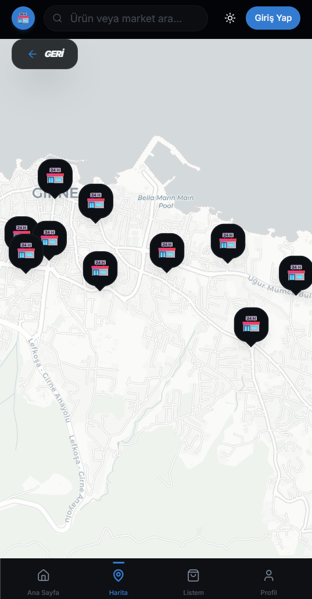
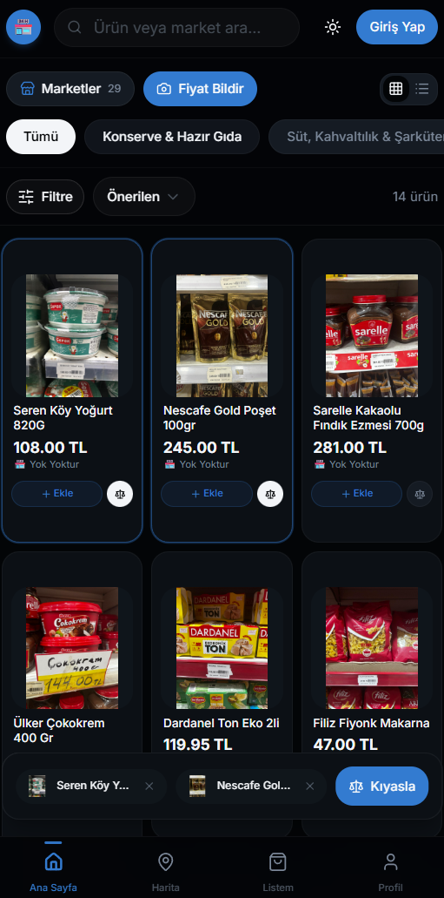
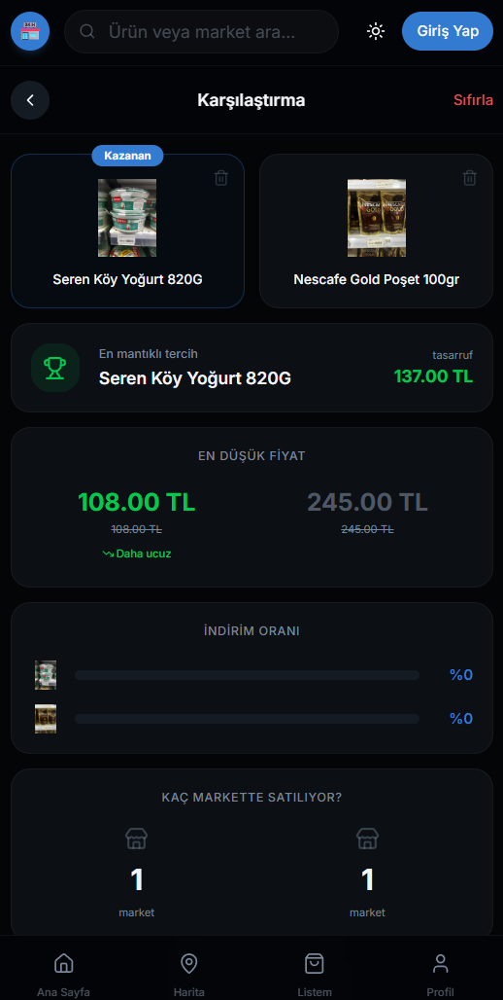
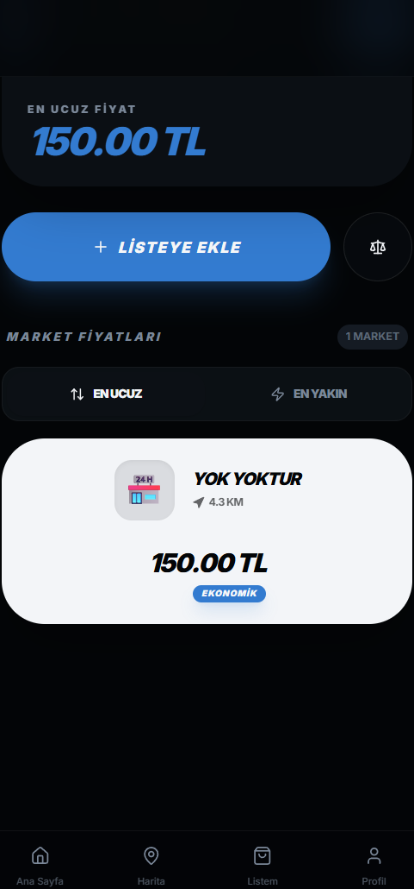
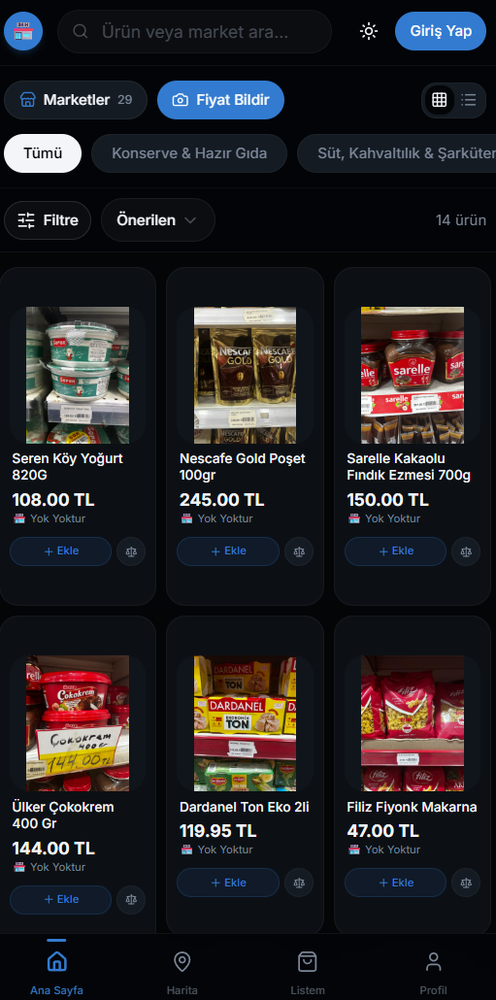
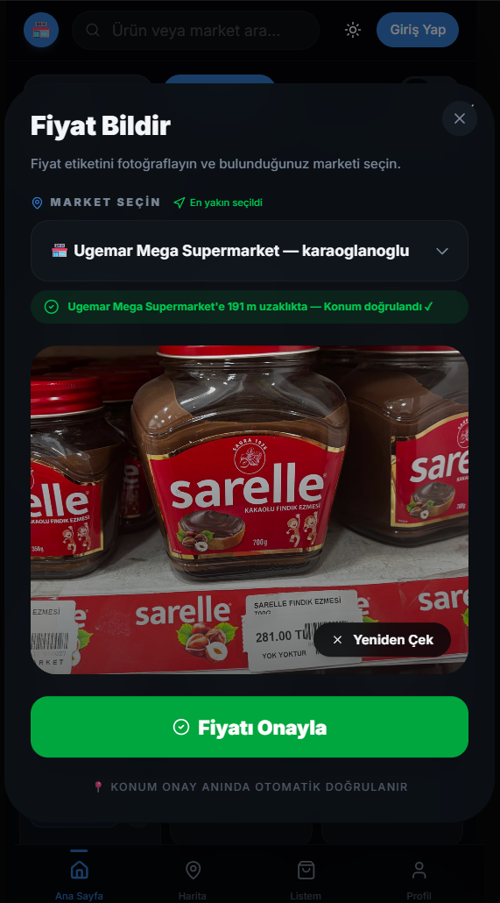
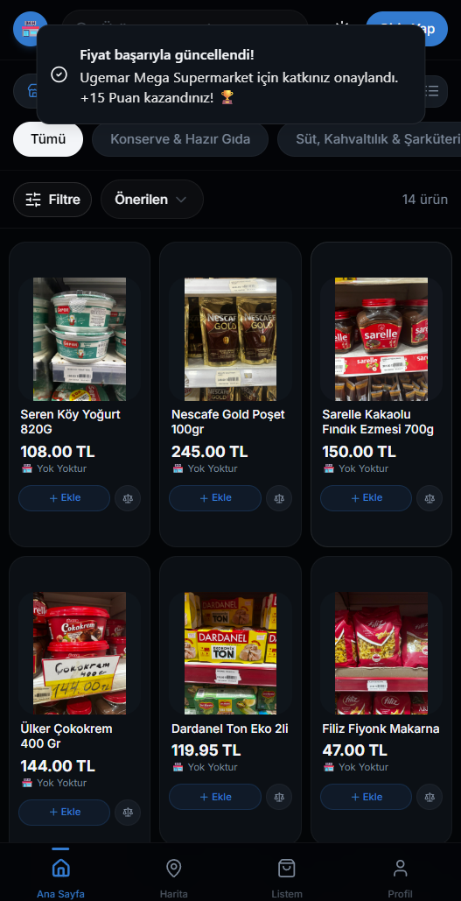

 

# 🛒 Marketle 

### Find the cheapest grocery store in your neighborhood — powered by the community, in real time
(MVP - Minimum Viable Product)
 

 

---

## 📖 About the Project

**Marketle** is a free, community-driven web app that lets you compare real-time grocery prices across local supermarkets in your district.

Prices are kept up-to-date by the community through an AI-powered photo submission system. When a user photographs a price label at the shelf, the built-in AI reads the product name, price, and unit automatically and writes it to the database — no manual entry required.

Marketle is built as a **PWA (Progressive Web App)**, meaning it can be installed directly to a phone's home screen on iOS and Android without going through any app store.

---

## 📸 Screenshots

### Home Screen — Product Grid

When the app opens, users are greeted by a product grid. Each card shows the product photo, lowest available price, which store offers that price, and the last update timestamp.

---

### Category Filter

A horizontally scrollable category bar sits at the top. Tapping a category instantly filters the product list (e.g. Dairy & Deli, Canned & Ready Meals). The active product count updates in real time.

---

### Store List

Tapping the **Stores** button opens the full list of registered supermarket branches. Each row shows the store name, neighborhood, and number of products in the system. Stores with active prices display a "Starting from X TL" label.

---

### Map View

The Map tab renders all store locations as pins on an interactive map. The user's own GPS location is also plotted, making it easy to spot the nearest store at a glance.

---

### Product Comparison

Tapping the **⚖️ icon** on any product card adds it to a comparison tray pinned to the bottom of the screen. Once two or more products are selected, tapping **Compare** opens the comparison view:

- The **Winner** badge is automatically applied to the cheapest product
- The price difference (TL savings) between the products is displayed
- Lowest price, discount rate, and number of stores selling each product are shown side by side

---

### Product Detail — Store Prices

Tapping a product opens its detail page, listing every store that carries it along with each store's price. The sort order can be toggled between **Cheapest** and **Nearest** (based on GPS location). Distance from the user is shown on each store card.

---

### AI-Powered Price Reporting

Tapping the **📷 Report Price** button opens the price submission screen. The system asks for two things:

1. **Store Selection:** The app reads the user's GPS coordinates and automatically suggests the nearest store (e.g. *"191 m from Ugemar Mega Supermarket — Location verified ✓"*).
2. **Photo:** A clear photo of the price label, taken from the camera or chosen from the gallery.

After tapping **Confirm Price**, the system re-checks the user's location. If the user is more than **200 meters** from the selected store, the submission is rejected. If valid, the AI processes the image and writes the product name and price to the database automatically.

After a successful submission, the user receives a **+15 Points** toast notification confirming the contribution was accepted.

---

## ✨ Features

**Smart Search**
Live search by product or store name with debounce — no request is fired on every keystroke. Results are grouped into Products and Stores, appearing after 2 characters are typed.

**Product Listing & Cards**
Toggle between Grid (3-column) and List (single-column) views. Smooth skeleton loading animations play during data fetches.

**Category Filtering**
Dynamic category chips populated from the database. Active product count updates instantly on every switch.

**Store Profile Pages**
Every store branch has its own dedicated page listing all products and prices available at that location.

**Map Integration**
All store locations displayed as custom pins on an interactive Leaflet.js + OpenStreetMap map — no Google Maps API dependency, completely free and open source.

**Product Comparison**
Compare two or more products side by side. The winner is auto-labeled, TL savings are shown, and discount rates are displayed.

**AI-Powered Price Reporting**
Users photograph a shelf price label; the AI reads the product name and price automatically. GPS verification ensures only in-store photos are accepted (≤200 m radius).

**Points & Gamification**
Every accepted price submission earns the user +15 Points, tracked on their profile page.

**Notifications**
Push notifications for new price updates (if permission is granted). In-app toast notifications for all user actions.

**User Accounts**
Sign up, login, and a personal *My List* page per user.

**PWA Support**
Installable to the home screen on iOS and Android. Custom empty-state screens are shown when offline.

**Dark Mode**
Automatic light/dark theme switching based on system preference.

---

## 🧰 Tech Stack

| Layer | Technology |
|---|---|
| **Framework** | Next.js (App Router) |
| **Language** | TypeScript |
| **Styling** | Tailwind CSS |
| **UI Components** | shadcn/ui + Radix UI |
| **Animations** | Framer Motion |
| **Map** | Leaflet.js + OpenStreetMap |
| **Database & Auth** | Supabase (PostgreSQL) |
| **AI / OCR** | Gemini Flash API |
| **Notifications** | Sonner + Web Push API |
| **PWA** | next-pwa |
| **Hosting** | Vercel |

---

## 👥 Development Team

Developed by a team of 5 over 7 weeks. Project research, system architecture, and team leadership were carried out by Bora Polat.

| Team | Members | Responsibility |
|---|---|---|
| **Frontend & UX** | Alya Zubeyde Ahmad | Next.js UI, mobile responsiveness, map integration, PWA setup |
| **Backend & Data** | Özgen Özkaran, Elif Şentürk | Database architecture, security policies, query optimization |
| **AI & Operations** | Bora Polat, İbrahim Değer | Gemini API integration, AI-based image analysis and data insertion automation, data validation logic, and seed data. |

---

## 📄 License & Contact

**© 2026 Bora Polat. All Rights Reserved.**

This repository is for **showcase and portfolio purposes only**. The source code, design, and architecture are proprietary and closed-source. You may not copy, distribute, modify, or use any part of this project without explicit written permission.

 

  <strong>Marketle</strong> — Live prices, powered by the community 🛒

